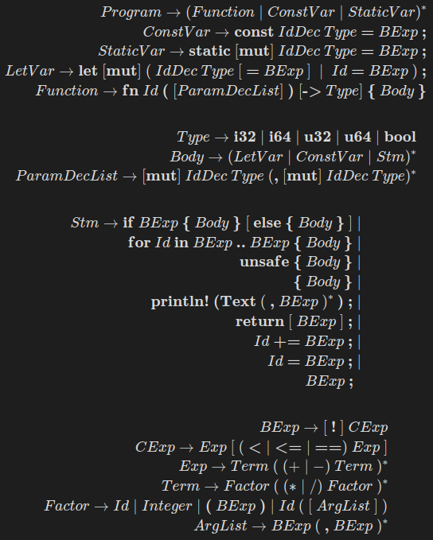

# Gramática Rust 

Esta es la gramática que representa el lenguaje de cadenas aceptadas por mi parser. Puede que hayan algunas diferencias entre esta y la implementación real, pero conceptualmente se da a entender la idea.

